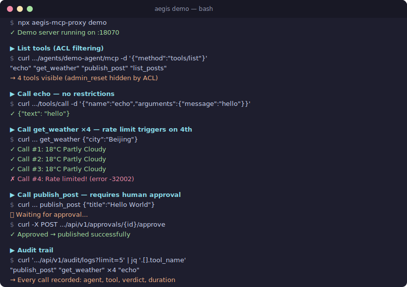

# Aegis MCP

[](https://github.com/bigmoon-dev/Aegis/actions/workflows/ci.yml)
[](docs/testing.md)
[](https://goreportcard.com/report/github.com/bigmoon-dev/aegis)
[](LICENSE)

**MCP 协议层治理代理 — 将软规则变成硬约束。**

[English](README.md) | 中文

Aegis MCP 作为透明协议代理，位于 AI Agent 与 MCP 工具服务器之间，在协议层实施 Agent 无法绕过的硬约束 — 频率限制、访问控制、人工审批、串行执行队列和完整审计日志。任何 MCP 兼容 Agent 均可直接使用，零代码改动。

```
         AI Agents
    ┌────────┬────────┐
  Agent    Agent    Agent
    A        B        C
    │        │        │
    └────┬───┴───┬────┘
         ▼       ▼
┌────────────────────────────────┐
│       Aegis MCP (:18070)       │
│                                │
│  Pipeline:                     │
│  ① ACL → ② Rate Limit         │
│  → ③ Human Approval            │
│  → ④ FIFO Queue → ⑤ Forward   │
│  → ⑥ Audit Log                │
└───────────────┬────────────────┘
                ▼
┌────────────────────────────────┐
│       MCP Tool Server          │
│       (e.g. social media,      │
│        database, APIs...)      │
└────────────────────────────────┘
```

<p align="center">
  
</p>

## 为什么需要 MCP 代理？

AI Agent 能力强大，但不是可靠的规则执行者。基于 prompt 的"软规则"（如"每天最多发一篇"）经常被违反。当 Agent 操作真实账号 — 社交媒体、电商、客服 — 一次失控的操作就可能触发平台封禁、合规违规，甚至更严重的后果。

Aegis MCP 将软规则转化为 **MCP 协议层的程序化硬约束**。无论 LLM 做出什么决策，Agent 都无法超出频率限制或跳过审批步骤。

与需要修改每个 Agent 代码的 SDK 方案不同，Aegis MCP 是**透明协议代理** — 将 Agent 指向 Aegis MCP 而非后端，治理自动生效。兼容任何 MCP 协议 Agent：Claude Code、OpenClaw、自定义 Agent 等。

## 功能特性

- **访问控制 (ACL)** — 按 Agent、后端、工具粒度的 allow/deny 规则。被禁止的工具对 Agent 不可见（从 `tools/list` 响应中移除）。

- **两级频率限制** — 单 Agent 滑动窗口限制 *和* 跨 Agent 全局限制。多个 Agent 共享同一账号？全局限制防止累积超频。

- **人工审批流程** — 破坏性操作（发布、删除）需通过 Webhook 通知获取人工审批，回调 URL 采用 HMAC 签名。支持飞书/Lark、通用 Webhook（Slack、Discord、自建系统等），可同时启用。可配置超时时间，超时自动拒绝。

- **FIFO 执行队列** — 按后端串行执行，操作间随机延迟（1-10 分钟，可配置），模拟人类操作节奏。只读工具可配置跳过队列。

- **审计日志** — 每次工具调用均记录到 SQLite：Agent、工具、参数、ACL/限流/审批结果、队列位置、执行耗时、返回结果。支持自动清理和可配置的保留天数。

- **工具描述增强** — 约束信息注入到工具描述中，Agent 看到的是 `[Rate:1/1d|ApprovalRequired] 发布笔记` 而非 `发布笔记`。Agent 在决策前就能感知自身限制。

- **热更新** — 通过 `POST /api/v1/config/reload` 更新配置，无需重启服务。

- **单二进制部署** — Go 编写，仅 5 个直接依赖，可在树莓派上运行。

## 安装

### npm（推荐 MCP 用户使用）

```bash
npx aegis-mcp-proxy config/aegis.yaml
# 或全局安装：
npm install -g aegis-mcp-proxy
aegis-mcp-proxy config/aegis.yaml
```

### 预编译二进制

从 [GitHub Releases](https://github.com/bigmoon-dev/Aegis/releases) 下载：

```bash
tar xzf aegis_v*.tar.gz
./aegis config/aegis.yaml
```

### Docker

```bash
docker run --rm -v $(pwd)/config:/config ghcr.io/bigmoon-dev/aegis /config/aegis.yaml
```

### go install

需要 Go 1.24+ 和 CGO (gcc)：

```bash
CGO_ENABLED=1 go install github.com/bigmoon-dev/aegis/cmd/aegis@latest
aegis config/aegis.yaml
```

### 从源码构建

```bash
git clone https://github.com/bigmoon-dev/Aegis.git
cd Aegis
make build
./aegis config/aegis.yaml
```

## 快速开始

2 分钟体验 Aegis：

```bash
npx aegis-mcp-proxy demo
```

跟随终端打印的 curl 示例，体验 ACL 过滤、限流、人工审批和审计日志。

准备接入自己的 MCP 服务器？选择你的 Agent：

| 指南 | Agent | 耗时 |
|------|-------|------|
| [Claude Code 接入指南](docs/guide-claude-code_cn.md) | Claude Code (Anthropic) | 5 分钟 |
| [OpenClaw 接入指南](docs/guide-openclaw_cn.md) | OpenClaw | 10 分钟 |
| [通用 Agent 接入指南](docs/guide-generic_cn.md) | 任何 MCP 兼容 Agent | 5 分钟 |

> **English**: [Claude Code](docs/guide-claude-code.md) · [OpenClaw](docs/guide-openclaw.md) · [Generic Agent](docs/guide-generic.md)

### 交互式配置向导（推荐新用户使用）

最快生成可用配置的方式：

```bash
./aegis setup
# 或: npx aegis-mcp-proxy setup
```

向导会引导你完成：

1. **后端地址** — 输入 MCP 服务器地址，Aegis 自动连接并发现可用工具
2. **逐工具策略** — 根据工具名称智能推荐默认策略（只读工具不限制，发布/写入工具自动加限流 + 审批，危险工具默认禁止）
3. **Agent 配置** — 自动检测已安装的 Agent，将 Aegis 代理地址注入其配置文件
4. **审批通知** — 配置飞书/Lark 或通用 Webhook URL 用于审批请求推送（仅在有工具需要审批时出现），自动检测本机 IP 作为回调地址

支持的 Agent：

| Agent | 配置文件 | 检测方式 |
|-------|---------|---------|
| OpenClaw | `~/.openclaw/workspace/config/mcporter.json` | 自动检测 |
| Claude Code | `~/.claude/mcp_servers.json` | 自动检测 |
| 自定义 Agent | — | 手动配置 |

向导在修改任何 Agent 配置前会自动创建 `.bak` 备份，写入后验证 JSON 格式。如果同一后端已有配置条目，会提示冲突处理。

### 交互式 Demo

5 分钟体验 Aegis 全部功能，无需搭建后端。只需 Node.js：

```bash
./aegis demo
# 或: npx aegis-mcp-proxy demo
```

启动后会自动运行 mock MCP 服务器 + Aegis 代理（内置预配置策略），终端打印 curl 命令供逐步体验：

| 步骤 | 效果 |
|------|------|
| `tools/list` | `admin_reset` 被 ACL 隐藏，只显示 4 个工具 |
| `echo` | 无任何限制，直接通过 |
| `get_weather` ×4 | 前 3 次成功，第 4 次被限流（`-32002`） |
| `publish_post` | 阻塞等待人工审批（通过管理 API 批准） |
| `list_posts` | 旁路 FIFO 队列，立即返回 |
| `audit/logs` | 查看所有操作的完整审计日志 |

### 交叉编译（树莓派）

```bash
# 需要交叉编译器（CGO/SQLite 依赖），例如 aarch64-linux-gnu-gcc
CC=aarch64-linux-gnu-gcc make cross-rpi
scp aegis user@your-server:~/aegis/

# 或直接在目标机器上构建：
ssh user@your-server 'cd ~/aegis && make build'
```

## 配置

详细的策略编写文档请参阅 **[策略配置指南](docs/policy-guide_cn.md)**，包含字段说明、时间格式、策略交互关系和常见场景。

基本示例：

```yaml
server:
  listen: ":18070"
  read_timeout: 300s
  write_timeout: 300s
  # api_token: "your-secret-token"   # 保护 /api/v1/ 端点（可选）

backends:
  my-tools:
    url: "http://localhost:8080/mcp"    # 你的 MCP 工具服务器
    health_url: "http://localhost:8080/health"
    timeout: 120s

queue:
  my-tools:
    enabled: true
    delay_min: 60s                      # 操作间最小延迟
    delay_max: 600s                     # 操作间最大延迟
    max_pending: 50
    bypass_tools:                       # 跳过队列（仍受限流约束）
      - "health_check"
    global_rate_limits:                 # 跨所有 Agent 的全局限制
      risky_operation: { window: 1h, max_count: 10 }

agents:
  production-agent:
    display_name: "Production Agent"
    auth_token: "your-secret-token-here"  # 可选：要求 Bearer token 认证
    backends:
      my-tools:
        allowed: true
        tool_denylist: ["dangerous_tool"]
        rate_limits:
          publish: { window: 24h, max_count: 1 }
        approval_required:
          - "publish"
          - "delete"

  dev-agent:
    display_name: "Dev Agent"
    backends:
      my-tools:
        allowed: true
        tool_denylist: ["publish", "delete", "dangerous_tool"]

approval:
  feishu:
    webhook_url: ""                     # 你的飞书 Webhook URL
  generic:
    webhook_url: ""                     # 任意 Webhook URL（Slack、Discord、自建系统等）
  timeout: 600s
  callback_base_url: "http://your-server:18070"

audit:
  db_path: "./data/audit.db"
  retention_days: 90
```

## 处理管道

每个 `tools/call` 请求依次经过：

| 阶段 | 职责 | 拒绝时 |
|------|------|--------|
| **ACL** | Agent 是否有权调用此工具？ | JSON-RPC `-32001` |
| **频率限制** | 全局 + 单 Agent 滑动窗口检查 | JSON-RPC `-32002` |
| **审批门控** | 通过 Webhook 通知请求人工审批 | JSON-RPC `-32004`（超时） |
| **FIFO 队列** | 随机延迟的串行执行 | JSON-RPC `-32003`（队列满） |
| **转发器** | 代理到后端 MCP 服务器 | 后端错误 |
| **审计日志** | 记录所有操作到 SQLite | — |

仅成功的调用计入频率限制（失败调用不消耗配额）。

## 管理 API

配置 `server.api_token` 后，所有 `/api/v1/` 端点需要 `Authorization: Bearer <token>` 请求头。未配置时 API 开放访问（适用于仅监听 localhost 的部署）。

```
GET  /health                           # 服务 + 后端健康检查
GET  /api/v1/queue/status              # 各后端的队列状态
GET  /api/v1/agents                    # Agent 列表与权限
GET  /api/v1/agents/{id}/rate-limits   # 当前用量与限额（Agent + 全局维度）
GET  /api/v1/approvals/pending         # 待审批列表
POST /api/v1/approvals/{id}/approve    # 通过 API 批准
POST /api/v1/approvals/{id}/reject     # 通过 API 拒绝
GET  /api/v1/audit/logs                # 查询审计日志（?limit=50&offset=0）
POST /api/v1/config/reload             # 热更新配置
```

## 工作原理

1. Agent 发送 MCP 请求到 `http://aegis:18070/agents/{agent-id}/mcp`
2. Aegis MCP 从 URL 路径识别 Agent 身份
3. `tools/list` → 从后端获取工具列表，过滤禁止的工具，注入约束标注
4. `tools/call` → 经过完整管道处理（ACL → 限流 → 审批 → 队列 → 转发 → 审计）
5. `initialize`、`ping` 等 → 透明转发
6. Agent 只能看到被允许的工具，只能执行被允许的操作

## 设计决策

| 决策 | 理由 |
|------|------|
| MCP 透明代理（非 SDK 集成） | 动态转发工具；零代码改动；兼容任何 MCP 协议 Agent |
| SQLite（非 Redis） | 最小化依赖；持久化审计记录；低资源占用 |
| 按后端分队列 | 共享同一账号的所有 Agent 必须全局串行 |
| HMAC 签名的审批回调 | 防止通过 URL 猜测进行未授权审批 |
| 全程 UTC 时间 | 避免夏令时切换导致限流窗口偏差 |
| 全局 + 单 Agent 频率限制 | 多 Agent 共享账号的累积频率控制 |

## 通用 Webhook 载荷

配置 `approval.generic.webhook_url` 后，Aegis 会发送 `Content-Type: application/json` 的 POST 请求：

```json
{
  "event": "approval_request",
  "id": "request-uuid",
  "agent_id": "production-agent",
  "tool_name": "publish",
  "arguments": "{...}",
  "created_at": "2026-03-12T10:00:00Z",
  "approve_url": "http://aegis:18070/callback/approval?id=xxx&action=approve&token=xxx",
  "reject_url": "http://aegis:18070/callback/approval?id=xxx&action=reject&token=xxx"
}
```

批准或拒绝只需对相应 URL 发送 GET 请求。飞书和通用 Webhook 可同时配置，两个渠道都会收到通知。

## 开发

### 运行测试

```bash
# 全部测试
CGO_ENABLED=1 go test ./... -count=1

# 带 race detector（推荐）
CGO_ENABLED=1 go test -race ./... -count=1

# 带覆盖率
CGO_ENABLED=1 go test -cover ./internal/...
```

测试使用临时 SQLite 数据库和内存配置，无需外部依赖。CI 在每次 push 和 PR 时自动运行 `go test -race`。

## 安全

- **Agent 端点认证**：在配置中为每个 agent 设置 `auth_token`，`/agents/{agentID}/mcp` 端点将要求 `Authorization: Bearer <token>`。token 长度至少 16 字符。未设置 `auth_token` 的 agent 保持开放（适合本地/演示使用）。**生产环境务必设置。**
- **管理 API 认证**：在配置中设置 `server.api_token`，所有 `/api/v1/` 端点将要求 `Authorization: Bearer <token>`。未设置时，任何能访问端口的人都可以批准操作、查看审计日志和重载配置。**生产环境务必设置。**
- **审批回调保护**：每个请求使用 HMAC-SHA256 签名 token（启动时随机生成 32 字节密钥），使用常量时间比较验证。
- **请求大小限制**：入站请求 1 MB，后端响应 10 MB。
- **TLS**：Aegis 监听 HTTP 明文。生产环境建议使用反向代理（nginx、Caddy）或仅绑定 localhost。
- **HMAC 密钥生命周期**：签名密钥在启动时内存中生成，重启 Aegis 会使所有待审批 token 失效。

## 环境要求

- Go 1.24+（需启用 CGO 以支持 SQLite）
- 一个兼容 MCP 协议的工具服务器作为后端

## 许可证

[Apache 2.0](LICENSE)

## 致谢

为治理在真实平台上运行的 AI Agent 而构建，源自社交媒体自动化风控的实战教训。

<!-- GitHub Topics: mcp, mcp-proxy, mcp-gateway, mcp-server, agent-governance, ai-agent, rate-limiting, access-control, audit-logging -->
